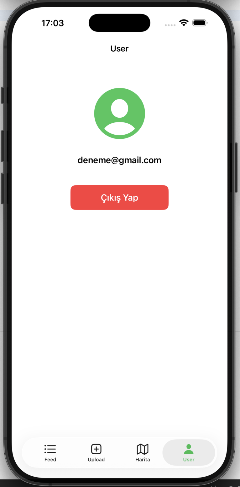
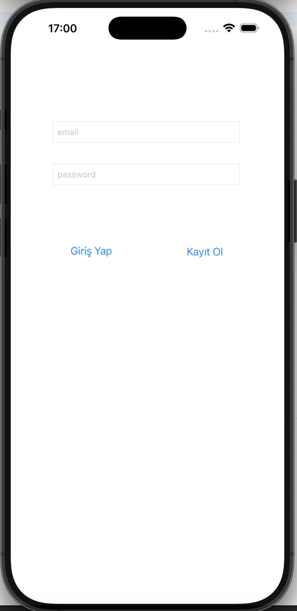
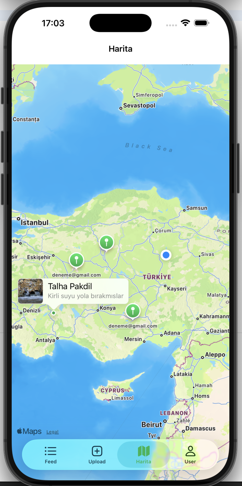

# EcoMap 🌍  
**Citizen-Driven Environmental Pollution Reporting App (iOS, MVVM + Firebase + MapKit)**

EcoMap, vatandaşların çevre kirliliği bildirimlerini basit bir şekilde paylaşmasını sağlayan modern bir iOS uygulamasıdır.  
Kullanıcılar kirlilikle ilgili bir **fotoğraf**, **açıklama** ve **harita üzerinden konum** seçerek bildirimi gönderir.  
Tüm bildirimler hem **Feed (Liste)** görünümünde hem de **Harita üzerinde pinler** olarak gösterilir.

Bu proje; MVVM mimarisi, Firebase Auth + Firestore + Storage, CoreLocation ve MapKit kullanılarak geliştirilmiştir.

---

## 📸 Screenshots

### Main Screens

<p align="center">
  
  
  
</p>

<p align="center">
  
    
</p>


---

## ✨ Features

### 🔐 Authentication
- Email + şifre ile giriş
- Kullanıcı adı + email + şifre ile kayıt olma
- Logout
- Oturumu hatırlama (auto-login)

### 🧱 Architecture
- Temiz **MVVM** mimarisi
- Firebase servisleri için ayrı Service katmanı:
  - `FirebaseAuthService`
  - `FirestoreService`
  - `StorageService`
- Tab Bar + çoklu ekran yapısı (Feed, Upload, Map, User)

### 📰 Feed
- Tüm kullanıcı raporlarını listeler
- Fotoğraf + kullanıcı adı + açıklama
- `SDWebImage` ile hızlı görüntü yükleme
- Firestore snapshot listener ile **gerçek zamanlı güncelleme**

### 📤 Upload
- Fotoğraf seçme (Photo Library)
- Açıklama ekleme
- Haritadan konum seçme (long press)
- Fotoğraf → Firebase Storage  
- Metadata → Firestore `reports` koleksiyonu

### 🗺 Map
- Bütün bildirimleri harita üzerinde gösterme
- Pin callout içinde **fotoğraf + açıklama + kullanıcı adı**
- İlk açılışta **kullanıcı konumuna otomatik zoom**
- Konum izni yönetimi (CoreLocation)
- Pinler Firestore’dan canlı alınır

### 👤 User Tab
- Kullanıcı email/username gösterimi
- Çıkış yapma fonksiyonu

---

## 🧰 Tech Stack

- **Swift**
- **UIKit**
- **MVVM Architecture**
- **Firebase**
  - Authentication
  - Cloud Firestore
  - Firebase Storage
- **SDWebImage**
- **MapKit**
- **CoreLocation**

---

## 📂 Project Structure

```text
EcoMap/
├── App/
├── Scenes/
│   ├── Auth/
│   ├── Feed/
│   ├── Upload/
│   ├── Map/
│   └── User/
├── Services/
├── Models/
├── Screenshots/
│   ├── feed.png
│   ├── upload.png
│   └── map.png
└── README.md

