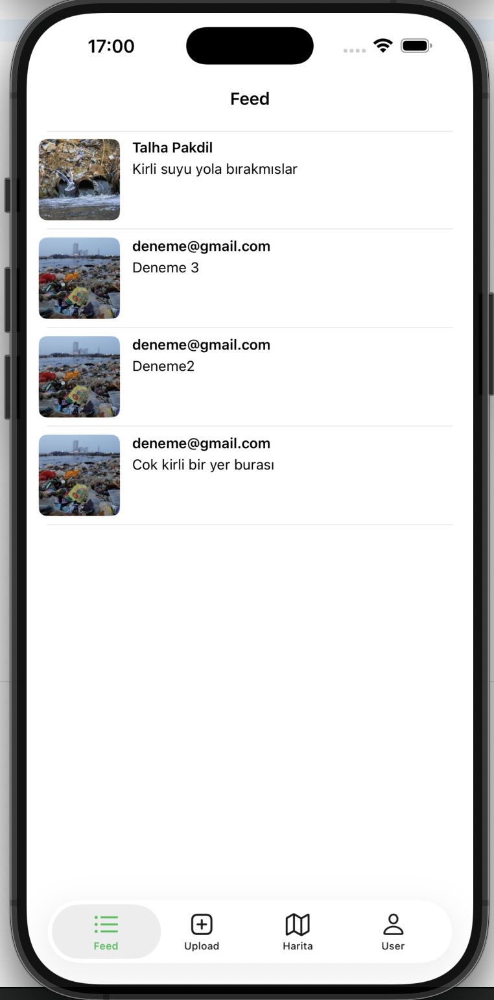
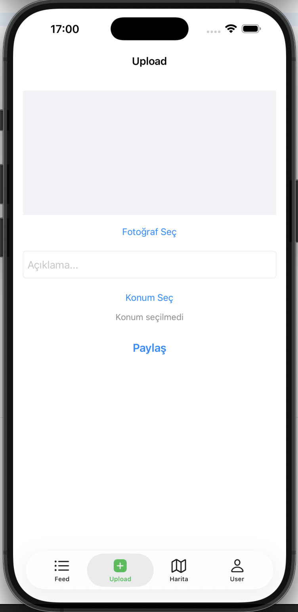
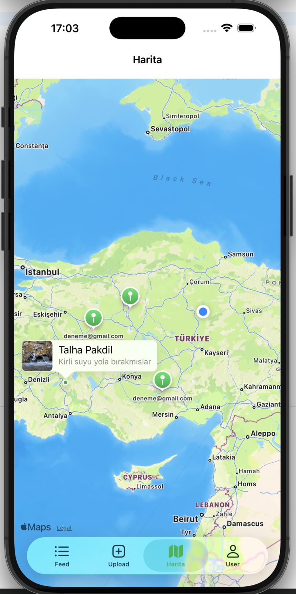

# EcoMap 🌍
## TÜBİTAK 2209-A Supported Research Project
## Mobile Application for Smart Environmental Pollution Reporting Based on Citizen Participation

EcoMap is a modern iOS application that enables citizens to report environmental pollution incidents quickly and easily.

Users can submit a pollution report by uploading a **photo**, adding a **description**, and selecting a **location on the map**. Reports are displayed both in a **Feed view** and as **map pins**, allowing users to explore environmental issues in their area.

The application is built using **MVVM Architecture**, **Firebase Authentication**, **Cloud Firestore**, **Firebase Storage**, **MapKit**, and **CoreLocation**.

---

## Screenshots

### Main Screens

<p align="center">
  
  
  
</p>

<p align="center">
  
  
</p>


---


###  Authentication

- User registration with username, email, and password
- Secure login using email and password
- Automatic session persistence (auto-login)
- Logout functionality

###  Architecture

- Clean MVVM architecture
- Dedicated service layer for Firebase operations:
  - `FirebaseAuthService`
  - `FirestoreService`
  - `StorageService`
- Tab Bar navigation with multiple screens:
  - Feed
  - Upload
  - Map
  - User Profile

### 📰 Feed

- Displays all pollution reports submitted by users
- Shows photo, username, and report description
- Fast image loading using SDWebImage
- Real-time updates powered by Firestore Snapshot Listeners

### 📤 Upload Report

- Select a photo from the device gallery
- Add a report description
- Choose a location directly on the map using long-press gestures
- Upload images to Firebase Storage
- Store report metadata in the Firestore `reports` collection

### 🗺 Map

- Displays all reports as map annotations
- Custom callouts showing:
  - Report photo
  - Username
  - Description
- Automatically centers on the user's current location
- CoreLocation-based permission management
- Real-time synchronization with Firestore

### User Profile

- Displays user information (username and email)
- Logout functionality

---

## Tech Stack

### Mobile Development

- Swift
- UIKit
- MVVM Architecture

### Backend & Cloud Services

- Firebase Authentication
- Cloud Firestore
- Firebase Storage

### Libraries & Frameworks

- SDWebImage
- MapKit
- CoreLocation

---

## 📂 Project Structure

```text
EcoMap/
├── App/
├── Scenes/
│   ├── Auth/
│   ├── Feed/
│   ├── Upload/
│   ├── Map/
│   └── User/
├── Services/
├── Models/
├── Screenshots/
│   ├── feed.png
│   ├── upload.png
│   └── map.png
└── README.md
```

---

##  Future Improvements

- Report categories (air pollution, waste, water pollution, noise pollution, etc.)
- Admin dashboard for report moderation
- Push notifications
- AI-powered image classification
- Heatmap visualization for pollution hotspots
- Advanced filtering and search capabilities

---

##  Purpose

EcoMap aims to increase environmental awareness and encourage citizen participation in environmental protection efforts. By enabling users to report pollution incidents in real time, the platform helps create a collaborative and data-driven approach to environmental monitoring.
